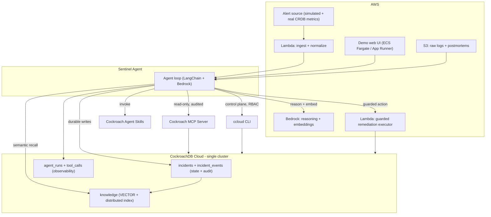

# Sentinel — Detailed Build Plan

> The on-call agent that never forgets. An autonomous database-reliability agent whose entire memory — transactional incident state, append-only audit trail, and semantic knowledge — lives in a single CockroachDB cluster, deployed on AWS.

**Hackathon:** CockroachDB x AWS — Build with Agentic Memory. Deadline **Aug 18, 2026, 5:00pm EDT**.
**Category fit:** agentic application using CockroachDB as the persistent memory layer, deployed on AWS.

---

## 1. Product summary

Sentinel watches a fleet of CockroachDB/Postgres databases. When an alert fires (high p99 latency, a hot range, a node down, a runaway query, disk pressure), Sentinel:

1. Opens an **incident** (durable, transactional working memory).
2. **Recalls** similar past incidents and runbooks via semantic (vector) search.
3. **Investigates** live cluster state (read-only, audited) and runs Cockroach ops **skills**.
4. **Reasons** with an LLM to form a hypothesis and a remediation plan.
5. **Remediates** through a guarded executor (dry-run + human approval on destructive ops).
6. **Learns**: writes a postmortem, embeds it, and stores it so the next incident is faster.

The differentiator is **memory that never goes down**: state, audit, and embeddings all live in one globally-distributed CockroachDB cluster. Kill a node mid-incident and the agent keeps its memory and resumes.

### Why it scores on all five equally-weighted criteria
- **Agentic Memory Design** — CockroachDB holds transactional state + append-only audit + vector knowledge in one system (no ETL, no separate vector store). Memory is load-bearing, not decorative.
- **Technical Implementation** — uses 4/4 Cockroach tools correctly and safely; SERIALIZABLE transactions; distributed vector index; read-only MCP; RBAC-scoped ccloud.
- **Real-World Impact** — DBRE/on-call toil is expensive and universal; an agent with perfect institutional memory is genuinely useful.
- **Product Readiness** — read-only-by-default reads, RBAC service accounts, full audit log, dry-run + approval gate, observability, live failure demo.
- **Creativity & Originality** — an agent that operates the very database that is its own memory; self-referential and rare.

---

## 2. Tool coverage (requirement: >=2 Cockroach + >=1 AWS — we use 4 + 3)

| Layer | Tool | What the agent actually does with it |
| --- | --- | --- |
| Cockroach | **Distributed Vector Indexing** | Stores + queries embeddings of past incidents, postmortems, and runbooks for semantic recall. Grows without a separate vector DB. |
| Cockroach | **Managed MCP Server** (`https://cockroachlabs.cloud/mcp`) | The agent's read path into live cluster state — read-only by default, fully audited. Also demoed inside Cursor. |
| Cockroach | **ccloud CLI (agent-ready)** | The agent's control-plane path: node/cluster status, backups, audit logs — via a scoped service account with JSON output. |
| Cockroach | **Agent Skills Repo** | The agent invokes existing open-source skills: triaging live SQL activity, analyzing range distribution, profiling statement/transaction fingerprints, monitoring background jobs. |
| AWS | **Bedrock** | Foundation model for reasoning (hypothesis + plan) and for embeddings (Titan Text Embeddings v2). |
| AWS | **Lambda** | Serverless alert ingestion + the guarded remediation executor. |
| AWS | **S3** | Raw log/diagnostic artifact storage and postmortem documents (source for embeddings). |

> Note: "at least 2 Cockroach + at least 1 AWS" is the floor. We deliberately overshoot to strengthen the *Technical Implementation* score, but the **minimum viable submission** only needs Distributed Vector Indexing + MCP + Bedrock. Everything else is upside — see Section 11 (cut-lines).

---

## 3. Architecture



Data-flow note: MCP and ccloud both reach the same cluster but through different planes — MCP is the **data plane** (SQL reads), ccloud is the **control plane** (cluster ops). That separation is the story for the "correct and safe tool use" criterion.

---

## 4. Repository layout

```
sentinel/
  README.md                 # setup, seed, run, architecture, tool/AWS usage writeup
  LICENSE                   # Apache-2.0 (visible in About)
  pyproject.toml            # deps pinned
  .env.example              # all config keys, no secrets
  docker-compose.yml        # local CRDB option for offline dev
  infra/
    schema.sql              # DDL (tables + vector index)
    seed_runbooks.py        # embeds + loads seed runbooks/postmortems
    ccloud_setup.md         # service-account + RBAC steps
    aws_setup.md            # Bedrock access, Lambda, S3, IAM
  src/sentinel/
    config.py               # env + settings (pydantic-settings)
    db.py                   # psycopg3 connection pool, retries on serialization errors
    memory.py               # incident state machine + audit writes + vector recall
    embeddings.py           # Bedrock Titan v2 embeddings wrapper
    llm.py                  # Bedrock Claude (ChatBedrockConverse) wrapper
    agent.py                # the LangChain agent loop + tool registry
    tools/
      mcp_read.py           # MCP client (read-only queries)
      ccloud.py             # subprocess wrapper over ccloud CLI (JSON)
      skills.py             # loader/runner for Cockroach Agent Skills
      remediate.py          # calls the remediation Lambda (dry-run + approval)
    postmortem.py           # generate + embed + store postmortem
    server.py               # FastAPI: UI + SSE stream of agent reasoning
    ui/                     # minimal single-page UI (incident feed, trace, audit)
  lambdas/
    ingest/handler.py       # normalize alert -> POST to agent
    executor/handler.py     # execute a whitelisted remediation, log to CRDB+S3
  scripts/
    demo_incident.py        # fire a scripted incident
    resilience_demo.sh      # kill node / failover mid-incident
  tests/
    test_memory.py          # state transitions + audit invariants
    test_recall.py          # vector recall returns the seeded match
    test_state_machine.py   # illegal transitions rejected
```

---

## 5. Data model (one CockroachDB database)

All memory lives in one DB. Embedding dimension **1024** matches Amazon Titan Text Embeddings v2.

```sql
-- infra/schema.sql
CREATE TABLE IF NOT EXISTS incidents (
  id            UUID PRIMARY KEY DEFAULT gen_random_uuid(),
  title         STRING NOT NULL,
  severity      STRING NOT NULL,                 -- sev1..sev4
  status        STRING NOT NULL DEFAULT 'open',  -- open|diagnosing|remediating|resolved|failed
  cluster_ref   STRING,                          -- which db/cluster the incident is about
  signal        JSONB NOT NULL,                  -- normalized alert payload
  hypothesis    STRING,
  resolution    STRING,
  created_at    TIMESTAMPTZ NOT NULL DEFAULT now(),
  updated_at    TIMESTAMPTZ NOT NULL DEFAULT now()
);

-- append-only timeline = observability + audit trail
CREATE TABLE IF NOT EXISTS incident_events (
  id           UUID PRIMARY KEY DEFAULT gen_random_uuid(),
  incident_id  UUID NOT NULL REFERENCES incidents(id),
  ts           TIMESTAMPTZ NOT NULL DEFAULT now(),
  actor        STRING NOT NULL,                  -- agent|human|system
  kind         STRING NOT NULL,                  -- observation|decision|action|approval|error
  detail       JSONB NOT NULL
);
CREATE INDEX IF NOT EXISTS idx_events_incident ON incident_events (incident_id, ts);

-- long-term semantic memory: runbooks + auto-written postmortems
CREATE TABLE IF NOT EXISTS knowledge (
  id          UUID PRIMARY KEY DEFAULT gen_random_uuid(),
  source      STRING NOT NULL,                   -- runbook|postmortem
  title       STRING NOT NULL,
  content     STRING NOT NULL,
  metadata    JSONB,
  embedding   VECTOR(1024) NOT NULL,
  created_at  TIMESTAMPTZ NOT NULL DEFAULT now()
);

-- distributed vector index for fast semantic recall at scale
CREATE VECTOR INDEX IF NOT EXISTS idx_knowledge_embedding
  ON knowledge (embedding);

-- observability of the agent itself
CREATE TABLE IF NOT EXISTS agent_runs (
  id           UUID PRIMARY KEY DEFAULT gen_random_uuid(),
  incident_id  UUID REFERENCES incidents(id),
  started_at   TIMESTAMPTZ NOT NULL DEFAULT now(),
  ended_at     TIMESTAMPTZ,
  status       STRING NOT NULL DEFAULT 'running',
  model        STRING
);
CREATE TABLE IF NOT EXISTS tool_calls (
  id         UUID PRIMARY KEY DEFAULT gen_random_uuid(),
  run_id     UUID NOT NULL REFERENCES agent_runs(id),
  ts         TIMESTAMPTZ NOT NULL DEFAULT now(),
  tool       STRING NOT NULL,                    -- mcp|ccloud|skill|remediate|embed|llm
  args       JSONB,
  result     JSONB,
  ok         BOOL NOT NULL,
  latency_ms INT
);
```

Semantic recall query (cosine distance over the distributed vector index):

```sql
SELECT id, source, title, content,
       embedding <=> $1 AS distance
FROM knowledge
ORDER BY embedding <=> $1
LIMIT 5;
```

Invariants (enforced in `memory.py`, checked in tests):
- Status transitions must follow `open -> diagnosing -> remediating -> (resolved|failed)`; illegal jumps rejected.
- Every state change writes exactly one `incident_events` row (audit completeness).
- Destructive actions require an `approval` event before an `action` event.

---

## 6. Agent loop (detailed)

```
on_alert(signal):
  run = create_agent_run()
  incident = open_incident(signal)                    # transactional write + audit event
  log_event(incident, 'system', 'observation', signal)

  # 1. RECALL — long-term memory
  q = embed(signal_summary(signal))                   # Bedrock Titan v2
  memories = vector_recall(q, k=5)                    # distributed vector index
  log_event(incident, 'agent', 'observation', {recalled: memories.titles})

  set_status(incident, 'diagnosing')

  # 2. INVESTIGATE — live state (read-only) + skills + control plane
  live = mcp_read(diagnostic_queries_for(signal))     # read-only, audited
  skill_out = run_skills(relevant_skills(signal))     # e.g. triage live SQL, range distribution
  control = ccloud(['cluster','list','--format','json'])  # + node status

  # 3. REASON — Bedrock Claude
  plan = llm.plan(system=SENTINEL_SYSTEM,
                  context={signal, memories, live, skill_out, control})
  update_incident(incident, hypothesis=plan.hypothesis)
  log_event(incident, 'agent', 'decision', plan)

  # 4. REMEDIATE — guarded
  set_status(incident, 'remediating')
  for action in plan.actions:
    dry = remediate(action, dry_run=True)             # Lambda
    if action.destructive and not approved(incident, action):
      log_event(incident, 'agent', 'approval', {awaiting: action}); pause()
    result = remediate(action, dry_run=False)
    log_event(incident, 'agent', 'action', {action, result})

  # 5. LEARN — write postmortem back into memory
  pm = llm.postmortem(incident, timeline(incident))
  store_knowledge(source='postmortem', content=pm, embedding=embed(pm))
  set_status(incident, 'resolved'); update_incident(incident, resolution=pm.summary)
  end_agent_run(run, 'done')
```

Every `mcp_read`, `ccloud`, `run_skills`, `remediate`, `embed`, and `llm` call is wrapped to log a `tool_calls` row (args, result, ok, latency). That table *is* the observability story.

Reliability details:
- `db.py` retries transactions on CRDB serialization errors (`40001`) with backoff — required for correctness under a distributed DB and during the failover demo.
- The whole loop is **resumable**: because state lives in `incidents`/`incident_events`, a crashed or interrupted agent re-reads the row and continues. This is what makes the node-kill demo work.

---

## 7. Tool integration specifics

### 7.1 Distributed Vector Indexing
- `embeddings.py` calls Bedrock `amazon.titan-embed-text-v2:0` (1024-dim).
- Seed corpus: ~15–25 realistic runbooks + a few synthetic historical postmortems (`infra/seed_runbooks.py`).
- Recall via the `<=>` cosine operator against `idx_knowledge_embedding`.

### 7.2 Managed MCP Server (read path)
- Configure MCP from the Cockroach Cloud Console; store the connection config in `.env`.
- `tools/mcp_read.py` issues only `SELECT`/`SHOW` statements (diagnostics: `SHOW STATEMENTS`, `SHOW RANGES`, `crdb_internal` views). Read-only mode + audit logging is the safety guarantee.
- Also wire it into Cursor for the video (shows the "single config snippet" claim working).

### 7.3 ccloud CLI (control plane)
- `infra/ccloud_setup.md`: create a **service account** with least-privilege RBAC; authenticate non-interactively.
- `tools/ccloud.py`: subprocess wrapper, always `--format json`, parse to dict, log to `tool_calls`. Allow-list of subcommands (e.g. `cluster list`, `cluster info`, `cluster sql --...` read-only, backup listing). No destructive control-plane ops without approval.

### 7.4 Agent Skills Repo
- Vendor the relevant open-source Cockroach skills into `src/sentinel/tools/skills/` (respecting their license) or invoke via an MCP-compatible runner.
- `tools/skills.py` maps a signal type to the right skill(s): hot range -> analyzing range distribution; slow queries -> profiling statement fingerprints + triaging live SQL; background job stalls -> monitoring background jobs.

### 7.5 AWS
- **Bedrock**: request model access for a Claude model + Titan Embeddings v2 in the chosen region; `llm.py` uses `ChatBedrockConverse` via `langchain-aws`.
- **Lambda (ingest)**: HTTP endpoint (Function URL) that normalizes an alert and calls the agent.
- **Lambda (executor)**: the only component allowed to perform remediation; enforces an allow-list, supports `dry_run`, and writes results to CRDB + S3. Keeps destructive capability isolated and auditable.
- **S3**: bucket for raw diagnostic dumps and postmortem markdown; postmortems are the embedding source.

---

## 8. Security & production-readiness model (scored criterion)
- **Least privilege**: separate credentials for read (MCP, read-only SQL user), control plane (ccloud service account, scoped RBAC), and remediation (executor Lambda IAM role).
- **Read-only by default**: all investigation is non-mutating; mutation only through the executor Lambda.
- **Human-in-the-loop**: destructive actions block on an `approval` event surfaced in the UI.
- **Full audit**: `incident_events` + `tool_calls` + MCP audit log = complete, queryable trail.
- **Resilience**: SERIALIZABLE isolation + serialization-retry; resumable state; multi-node CRDB survives node loss.
- **Secrets**: `.env` locally, AWS Secrets Manager / SSM for deployed components; nothing committed.
- **Observability**: `/health`, structured logs, and a live agent-trace stream in the UI.

---

## 9. Seed incident scenarios (for demo + tests)

1. **Hot range / uneven load** — recall a prior "rebalance ranges" runbook; MCP shows `SHOW RANGES`; skill = range distribution; remediation = trigger rebalancing / split hint.
2. **Runaway query causing p99 spike** — skill = statement fingerprint profiling; MCP shows `SHOW STATEMENTS`; remediation = cancel query + recommend index.
3. **Node down** — ccloud shows node status; the incident continues while memory stays available (this doubles as the resilience demo).

Each scenario has a scripted trigger in `scripts/demo_incident.py` and a matching seeded historical postmortem so recall visibly helps.

---

## 10. Demo (the <3-minute video)
1. **Cold open (memory pays off)**: fire scenario #2. Show the agent recalling a *past* similar incident from the vector index and resolving faster because of it. (Agentic Memory Design)
2. **Money shot (memory never goes down)**: run `scripts/resilience_demo.sh` mid-incident to kill a CRDB node / trigger failover. Show reads/writes continue, zero data loss, agent resumes from persisted state. (Product Readiness + Memory Design)
3. **Safety**: show the approval gate blocking a destructive action, the audit timeline, and the read-only MCP audit log. (Technical Implementation + Product Readiness)
4. Close on the architecture diagram naming all 4 Cockroach tools + 3 AWS services.

Storyboard the script to land under 3:00; judges are not required to watch beyond it.

---

## 11. Scope control (lazy-but-safe cut-lines)
Build in this order; each line is independently demoable so you always have something to submit.

- **P0 (minimum viable, ~1 tool over floor)**: schema + vector recall + Bedrock reasoning + one scripted incident + local UI. Uses Vector Indexing + MCP + Bedrock. *This alone is a valid submission.*
- **P1 (strong)**: ccloud CLI + Agent Skills + postmortem learning loop + audit UI + deploy to AWS with a live URL.
- **P2 (winning polish)**: resilience/failover demo, human-approval gate, S3 artifacts, Lambda ingest+executor split.

Do not build multi-tenant auth, a fancy design system, or real alerting integrations — none are scored and all burn time.

---

## 12. Timeline (solo, ~4 weeks to Aug 18)

**Week 1 — foundation**
- Day 1: CockroachDB Cloud free cluster; run `infra/schema.sql`; create read-only SQL user.
- Day 2: AWS account + Bedrock model access (Claude + Titan v2); IAM; S3 bucket.
- Day 3: `db.py`, `embeddings.py`, `memory.py`; seed runbooks; prove vector recall (`test_recall.py`).
- Day 4: `llm.py` + skeleton `agent.py` loop end-to-end on one scenario (local).
- Day 5: MCP configured + `mcp_read.py`; wire into Cursor for the video.

**Week 2 — full loop**
- ccloud service account + `ccloud.py`; Agent Skills integration; remediation Lambda (dry-run + allow-list); postmortem learning loop; `tool_calls` logging everywhere.

**Week 3 — product + deploy**
- FastAPI UI (incident feed, live agent trace via SSE, audit timeline, approval button); Lambda ingest; deploy agent+UI to ECS Fargate / App Runner; get the public demo URL; safety gates.

**Week 4 — win polish + submit**
- Resilience/failover demo script; tests green; README + architecture diagram + tool/AWS writeup; Apache-2.0 license visible in About; record + edit <3 min video; **submit by ~Aug 15** (3-day buffer).

---

## 13. Verification (the one runnable check per non-trivial piece)
- `tests/test_recall.py` — seeded postmortem is the top vector hit for its matching signal.
- `tests/test_state_machine.py` — illegal status transitions raise; legal ones write one audit event.
- `tests/test_memory.py` — a destructive action without a prior `approval` event is rejected.
- `scripts/resilience_demo.sh` — asserts incident row + events are intact after a node kill (zero data loss).

---

## 14. Risks & mitigations
- **Bedrock model access delay** → request access Day 1; fall back to a different available Bedrock model; embeddings and CRDB logic don't depend on the reasoning model.
- **`CREATE VECTOR INDEX` syntax/version differences** → verify against the current Cockroach Cloud version first; fall back to exact `<=>` scan on the seed-size corpus if the index API differs (still demonstrates distributed vector *storage*; note the ceiling in README).
- **ccloud destructive-op risk** → allow-list + approval gate; never expose destructive control-plane ops unguarded.
- **Live failover in a free-tier cluster may be constrained** → if node-kill isn't controllable, simulate via a connection-level fault + show CRDB HA docs; keep the resumable-state proof (that's the real point).
- **Time overrun** → the P0/P1/P2 cut-lines guarantee a submittable artifact at every stage.

---

## 15. Submission checklist (from the rules)
- [ ] Public repo, open-source license (Apache-2.0) **visible in the About section**.
- [ ] README: setup, dependencies, seed data, run instructions — reproducible.
- [ ] Live functional demo URL.
- [ ] <3 min public YouTube/Vimeo video showing the CockroachDB memory layer at work + resilience.
- [ ] Text description of features.
- [ ] Explicit writeup: which Cockroach tools (MCP, ccloud, Vector Indexing, Skills) and what the agent did with each.
- [ ] Explicit writeup: which AWS services (Bedrock, Lambda, S3) and how.
- [ ] Architecture diagram (Section 3).
- [ ] New work, built during the submission period; disclose any pre-existing code.
- [ ] Submitted before deadline (target Aug 15).
